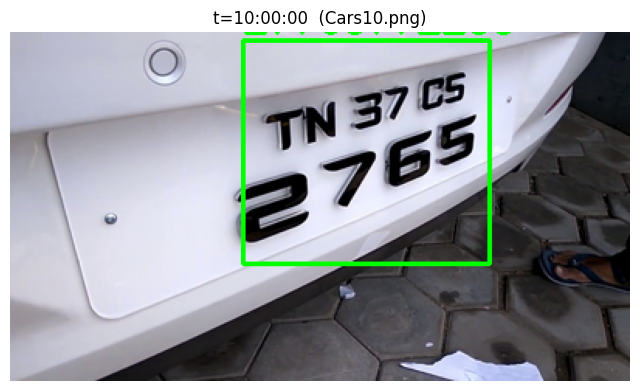
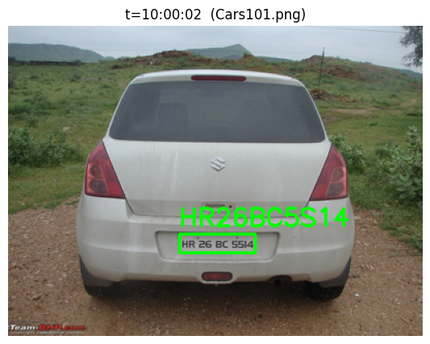
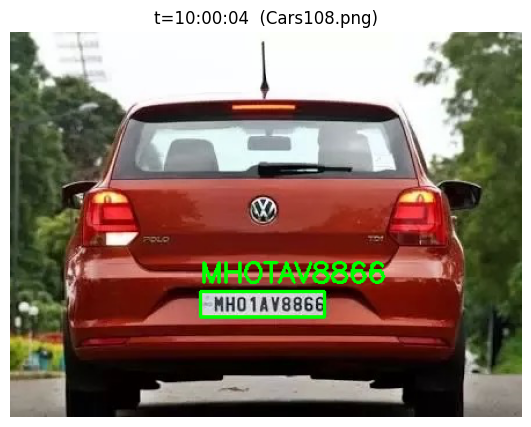

# SIH26127 — City-Wide ANPR Prototype (Edge-Tier CV Model)

Problem statement **SIH26127** (Bharat Electronics Limited) — this notebook builds and evaluates the **edge-tier computer-vision model** for a multi-camera ANPR system:

**YOLOv8 plate detector → OpenCV perspective straightener → EasyOCR reader**

Trajectory tracking, Kafka ingestion, and the traffic-analytics dashboard are separate services outside this notebook's scope.

## Pipeline

1. **Dataset** — `andrewmvd/car-plate-detection` (Kaggle), Pascal-VOC boxes collapsed to a single `plate` class.
2. **Detector** — YOLOv8n fine-tuned for ~40 epochs at 640px on a Kaggle T4 GPU.
3. **Straightener** — pure OpenCV, no learned weights: edge-detect → largest contour → min-area rotated rectangle → perspective warp. Falls back to a plain resize if no clean quadrilateral is found.
4. **Reader** — a single shared EasyOCR `Reader` instance; output is restricted to A–Z/0–9 and upper-cased before it counts as a "read."
5. **Chain** — one `process_frame()` call returns every plate found in a frame, boxed and read.
6. **Demo** — replays the detection dataset's own validation images as a simulated camera feed with synthetic timestamps, logging messages in the format `"I saw plate <text> at Camera #<id> at <timestamp>"`.

## Detection accuracy (plate localization)

Measured on the held-out validation split after fine-tuning:

| Metric | Value |
|---|---|
| Precision | 0.945 |
| Recall | 0.901 |
| mAP@0.5 | 0.930 |
| mAP@0.5:0.95 | 0.556 |

*(Also logged: ~6.1 ms inference / 3.6 ms preprocess / 2.6 ms postprocess per image on a T4 — relevant to the "edge node" real-time constraint, though note this ran on a full GPU, not actual edge hardware.)*

### What each metric actually tells you

- **Precision (0.945)** — of every box the model labeled "plate," what fraction was a real plate. High precision means very few false-positive detections cluttering the downstream OCR stage.
- **Recall (0.901)** — of every real plate in the validation images, what fraction the model actually found. ~90% means roughly 1 in 10 plates in this validation set goes undetected entirely.
- **mAP@0.5** — mean Average Precision when a predicted box only needs ≥50% IoU overlap with the ground truth to count as correct. With a single class, this is essentially "how good is the precision–recall trade-off at a lenient overlap threshold." 0.930 says the model is very reliable at finding roughly the right region.
- **mAP@0.5:0.95** — the same measure, averaged over stricter overlap thresholds from 0.5 up to 0.95. It punishes boxes that are in the right place but not tightly cropped. The gap between this (0.556) and mAP@0.5 (0.930) shows the model rarely misses a plate outright, but its box edges are often loose — which matters here because a loose crop feeds a worse image into the straightener/OCR stage.

## OCR / text-reading accuracy — not yet quantitatively measured

The notebook wires up two ways to score this (Step 7): **Character Error Rate (CER)** and **exact-match accuracy**, computed against labeled ground-truth plate *text*. Neither ran to completion in this notebook — the primary path needed a second Kaggle dataset with text labels attached, and the zero-dependency fallback needed ~15 hand-typed plate strings — and both the `test_samples` and `hand_labels` collections were left empty. So there's no CER/exact-match number to report from this run.

### What these two metrics would tell you, once filled in

- **Character Error Rate (CER)** — edit distance (insertions + deletions + substitutions) between the predicted string and the ground truth, divided by the ground-truth length. 0 = a perfect read; it's forgiving of small mistakes (one wrong character on a 10-character plate ≈ 0.1 CER), so it's a good "how close" measure.
- **Exact-match accuracy** — the stricter, binary version: the fraction of plates read 100% correctly, character for character. This is the number that actually matters operationally — a 90%-right plate string still fails a blacklist or database lookup, since there's no partial credit in a real ANPR match.

## Qualitative demo results

With no scored OCR metric available yet, the clearest evidence of current read quality comes from manually checking a few of the simulated demo's frames against the plate visible in each image:

*Ground truth `TN 37 CS 2765`, read as `27765772255`. The detection box is tight and correct — the two-line, embossed, low-contrast plate is what confuses the reader.*

*Ground truth `HR 26 BC 5514`, read as `HR26BC5S14`. Only one character off — a `5`/`S` confusion.*

*Ground truth `MH 01 AV 8866`, read as `MHOTAV8866`. Also only a couple of characters off — `0`/`O` and `1`/`T` confusion.*

**Pattern worth flagging:** detection is consistently tight in all three frames; the errors are all downstream in the reader, and they cluster around visually similar characters (`0`/`O`, `1`/`I`/`T`, `5`/`S`) plus non-standard, two-line plate layouts.

## Known limitations / next steps

- OCR text accuracy (CER, exact-match) isn't measured yet — attach `ckay16/indian-number-plate-detection` or `xairete/car-plates-ocr`, or hand-label ~15 images in the Step 7 fallback cell, to get a real number.
- The recurring character confusions (`0/O`, `1/I/T`, `5/S`) suggest a plate-specific allowlist tweak or a small post-processing correction step could help before investing in a custom OCR model.
- The mAP@0.5:0.95 gap suggests tighter box regression (more epochs, augmentation, or a larger YOLOv8 variant) would help more than more training data at this scale.
- Trajectory tracking, Kafka ingestion, and the dashboard are separate services, out of scope for this notebook.
